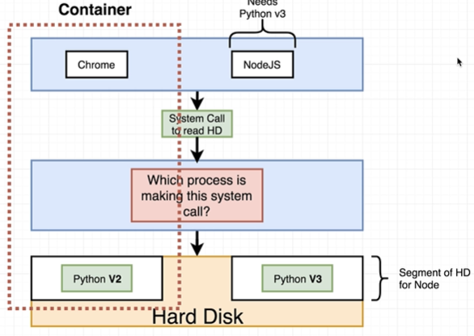
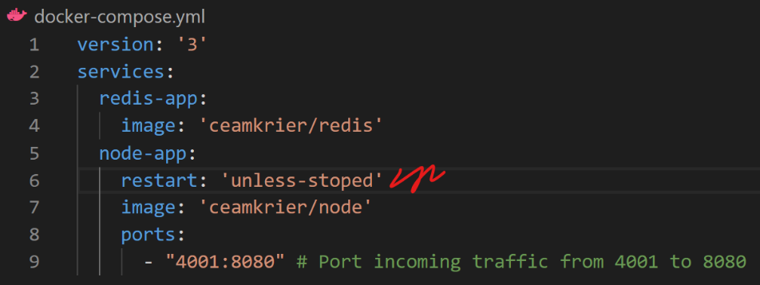

# Docker Adventure

Those notes based on the udemy course that being given by [Stephen Grider](https://www.udemy.com/course/docker-and-kubernetes-the-complete-guide/).

### Why docker?

### What is docker?

Container is a program with its own isolated set of hardware resources (own little space of memory, networking technology and hard drive)

Image is single file that has specifics to run a single program.
‘docker run redis’ for example: that would fetch the image from the docker hub (like GitHub but for docker images) and
run it and finally we will have our redis instance running in isolated container.

### How does `docker run hello-world` work?

If image that ran is locally presented(in image cache), then directly will be run.
Otherwise, image will be retrieved from docker hub and then run. Subsequent runs will be as above (from the cache).

### How does container work?

To understand that, we need to look at how the operating system works.

All running programs will issue requests to the Kernel to interact with a piece of hardware.
So, the job of the kernel to govern access between running processes and hardware.

Assume the following scenario:

Two programs running, Chrome needs py2 to run where NodeJS needs py3. But in the hard disk, we only have access to py2.
So, NodeJS will not be able to work. How can we make both to work?

Operating systems have a feature called as namespacing. With it, we can look at all the hardware resources connected to computer
and we can segment out portions of those resources.

As shown on left, we segment our hard disk dedicated specifically house py2 and py3.

To properly make both processes work, they has to access their segments.

To ensure Chrome and NodeJS has access to right segments, the kernel will govern that access.

Thus, Chrome and NodeJS will be able to work on the same machine (as the example).

Namespacing will isolate the hard drive resources per process/or for group of processes

Where control groups will limit the usage of the hard drives.

Specific to Linux OS

So the container will be then a running process/ or set of processes + segment of resources the process/es can talk to.
The container should not be thought as a physical construct.

The simplified version of the container as shown below

### Relation between Image and Container

How does the single image finally can create the container?

Whenever we talk about Image, we refer to a file system snapshot.
It is very specific set of directories and files that is required to run the process the image holds.

Image also has Startup Command that will isolate necessary hard drives and put file system
snapshot to a new segment inside the hard disk. Finally, the process will be run.

This is how the container then would look like
Chrome and Python placed into the segmented hard-drive

### How does docker run on my computer if namespacing is just specific for the Linux OS?

When we installed docker for Win/Mac, we installed a Linux virtual machine.
So as long as docker running, the Linux virtual machine will be running in your computer.

Inside of this virtual machine, all the containers will be created
and the Linux kernel then will be able to do namespacing on your hardware.

### Commands

 - ‘docker ps’: shows running docker containers
 - ‘docker ps --all’: shows all containers that have ran
 - ‘docker system prune’: removes stopped containers, build cache, dangling images
 - ‘docker create <container name>’: creates a container, returns id of it
 - ‘docker start <container id>’: starts the container in silent mode, outputs wont display (contrary to docker run which is compose of create + start and shows logs)
 - ‘docker stop <container id>’: stops container and gives possibility to do cleanup etc.
 - ‘docker kill <container id>’: stops container immediately, no cleanup. If ‘docker stop’ cannot stop the container in 10 sec, then this command automatically being run to kill process
 - ‘docker logs <container id>’: shows all the logs have been emitted while container working, does not re-run the container
 - ‘docker exec -it <container id> <command>’: allows us to run extra command in an already running container ex: running ‘docker run redis’ and then the redis-cli inside the running container
 - ‘docker exec -it <container id> sh/bash/zsh/powershell…’: opens the terminal of the container

### Flags

 - ‘start -a’: shows the output of the container in the terminal window where it ran
 - ‘logs -f/--follow’: live log tracing
 - ‘exec -it’: allows us to provide input to the container
 - ‘run -it sh’: start the container with shell, keeps default commands from running. Ultimately good for testing stuff ex: NodeJS to run js codes like chrome devtools
 - ‘exec -i’: gets the typed stuff to the running processes STDIN. It runs the command

 - ‘exec -t’: nicely formats + autocompletes (if command capable to do) the outputs on the screen

### Creating custom images

Downloading OS(base image) as alpine

By using ‘apk’ package manager, redis being downloaded and installed onto OS

Writing a dockerfile is like installing the chrome to a computer with no OS.

### Build process

In every step defined in dockerfile, a temporary container created to hold upcoming changes that are defined in that step.

Created container’s id is at the bottom with alpine OS installed inside of it.

In second step, firstly the temporary container created, and necessary changes made on it(downloaded and installed the redis).
After, the snapshot of that container taken, and a final container being created because of the step. Temporary container then deleted

Lastly, the commands are put into startup command of another temporary container that created from the snapshot of the previous step.
A new container created from the snapshot and temporary deleted. Thus, the build process succeeds

Below, overall flow can be seen.

If we run the docker build on the same dockerfile more than once, the cache mechanism will serve the already generated images for
unchanged steps inside the dockerfile. Starting from the changed step the temporary container creation flow will happen again. Great for speed.

### Tagging an image

### A NodeJS app with docker

We used alpine distro of Linux in previous examples as our base image. To create a NodeJS app, we need to have ‘npm’ installed on our file system too.
There is two way to achieve that. Either we specify the installation of ‘npm’ in the dockerfile or we use a base image that already have the ‘npm’ in it.

`FROM node:alpine`
To follow the second scenario, we must download the ‘node:alpine’ which is the Linux distro of alpine + NodeJS.

`COPY . .`
In NodeJS environment, dependencies of the application held in ‘package.json’ file. When the docker run the ‘npm install’ command to get
packages that being used at the project, the file must represent in the directory. To achieve that, we copy all the files of project to the docker
image’s filesystem with the command above.

At that point, the dockerized node app will successfully run. But when we try to access it on localhost address we simply
can’t (because of the isolated nature of the container). To overcome that, we need to run the container with an extra
argument to port incoming traffic from somewhere in the host machine to the container.

To specify a working directory, inside the dockerfile:

All the commands and instructions will be run relative to that directory.
That’s a good practice to define a working directory to not cause conflicts while copying project related files to the base images file system.

For example, if we change the content of ‘index.js’ on the application and re-run the docker build process,
docker will recognize the changed file and will not use cached version of that step and on the following steps.
That is not good in terms of performance. To overcome that:

We can just copy the ‘package.json’ file at first and run the ‘npm install’ to get needed packages and then copy the rest of the project files.
In that way, we will not wait for re-install of node packages if we just change the project related files except the ‘package.json’.

It is a good convention to copy just the bare minimum content in each successful step to avoid unnecessary step re-runs.

### Docker compose

We need to specify what containers should be able to network between each other in a file called docker-compose.yml.

We are using the example of NodeJS app + redis to discover docker-compose.
To establish communication between node app and redis, the docker-compose.yml file being used.

Services are images that we want to communicate between each other. Their names (‘redis-app’ or ‘node-app’) are becoming
accessible references inside the source codes. Check out the ‘redis-app’ reference at the ‘createClient’ function.

The ‘6379’ is the default port of the redis server.

### Docker compose commands

For some reason I could not see updated versions of my images when I ran that command. So had to re-build updated
image to see the change when I have run ‘docker-compose up’.

When we run the ‘docker-compose up’ command, it does run at the foreground.

And if we want to use the same terminal window then we can use the ‘-d’ flag to run whole process in the background.
We can stop all the containers that started by the docker-compose with ‘docker-compose down’.

### Automatic container restart in docker-compose

Those policies can be defined in the services that being ran by the docker-compose.

### Checking the status of docker-composed containers

All of the docker-compose commands work respect to a docker-compose.yml file. To successfully run those commands,
the corresponding ‘.yml’ file must exist in the folder where we run them.

### Docker volumes

Volume is useful for having updated version of the source code inside the container without having to stop, re-build and re-start again.

Instead of copying the filesystem of the project to the inside of the container, reference of those sources placed.
Those references are pointing to the folders inside the local machine.

Most of the time its not a good way to type hefty of extra arguments to your commands. It is best to keep them simple and short.
To achieve that, we can use the power of docker-compose to simplify the command above and achieve the same result one short command.

### Live updating tests

We can use the old command we learned, exec, to run additional commands inside of the already running container.

`docker exec -it <container-id> npm run test`

With that, whenever the content of tests change, they will automatically re-run.
